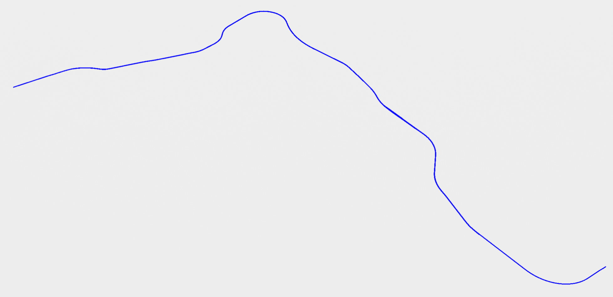

# AL01 - Multiple alignments of railway line

| Test code | Test author     | Test dataset source | Test direction |
|-----------|-----------------|---------------------|----------------|
| MF01      | Mercedes Santos, Chi Zhang             | SBB                 | Export, Import         |

## Intent

This Test belongs to a series of Tests that share a dataset from the same project as a business case. 
The intention of this Business Case is to test how model federation works in the context of IFC4.3. 
In particular we want to test the behaviour of objects that are located in relation to an alignemnt (for example a turnout within an alignment) and in relation to fixed coordinates (for example existing buildings) with georeferencing information set as the global context.
We would also like to test other essential concepts that are related to model federation like project break down structure (or to say, Spatial Structure) and revision and access control for elements.
The series of tests that belong to this Business Cases are listed as follows:

| Test code | Test name     | 
|-----------|-----------------|
| PS01      | Project setup with georeferencing |
| **AL01**      | **Multiple alignments of railway line** |
| LD01      | Loading gauge|
| TR01      | Track panels positioned along alignments |
| BD01      | Building and terrain as existing condition model |
| BD02      | Building positioned along alignment |
| DR01      | Drainage system for railway line |
| MF01      | Model federation|

With this series of tests, we are attempting to build a step-by-step process to realize a business case.
The dependency between them are shown in the following diagram:

To perform a certain test in this series, developers can start from the very beginning (AKA. PS01) to build all the prerequisites independently, or based on outcomes from prerequisites tests.

	
Main IFC concept involved in this test
 

The concept templates that are focused by this series of tests are listed as follows. Specific concept templates that are focused by this test are in Bold.

- [Project Global Positioning](https://ifc43-docs.standards.buildingsmart.org/IFC/RELEASE/IFC4x3/HTML/concepts/Project_Context/Project_Global_Positioning/content.html)
- [**Alignment Layout**](https://ifc43-docs.standards.buildingsmart.org/IFC/RELEASE/IFC4x3/HTML/concepts/Object_Composition/Nesting/Alignment_Layout/content.html)
- [Spatial Structure](https://ifc43-docs.standards.buildingsmart.org/IFC/RELEASE/IFC4x3/HTML/concepts/Object_Connectivity/Spatial_Structure/content.html)
- [Spatial Decomposition](https://ifc43-docs.standards.buildingsmart.org/IFC/RELEASE/IFC4x3/HTML/concepts/Object_Composition/Aggregation/Spatial_Decomposition/content.html)
- [Alignment Geometry](https://ifc43-docs.standards.buildingsmart.org/IFC/RELEASE/IFC4x3/HTML/concepts/Product_Shape/Product_Geometric_Representation/Alignment_Geometry/content.html)
- [Product Linear Placement](https://ifc43-docs.standards.buildingsmart.org/IFC/RELEASE/IFC4x3/HTML/concepts/Product_Shape/Product_Placement/Product_Linear_Placement/content.html)
- [Product Local Placement](https://ifc43-docs.standards.buildingsmart.org/IFC/RELEASE/IFC4x3/HTML/concepts/Product_Shape/Product_Placement/Product_Local_Placement/content.html)
- [Revision Control](https://ifc43-docs.standards.buildingsmart.org/IFC/RELEASE/IFC4x3/HTML/concepts/Object_Attributes/Revision_Control/content.html)
- [Software Identity](https://ifc43-docs.standards.buildingsmart.org/IFC/RELEASE/IFC4x3/HTML/concepts/Object_Attributes/Software_Identity/content.html)
- [Element Decomposition](https://ifc43-docs.standards.buildingsmart.org/IFC/RELEASE/IFC4x3/HTML/concepts/Object_Composition/Aggregation/Element_Decomposition/content.html)
- [Body Tessellation Geometry](https://ifc43-docs.standards.buildingsmart.org/IFC/RELEASE/IFC4x3/HTML/concepts/Product_Shape/Product_Geometric_Representation/Body_Geometry/Body_Tessellation_Geometry/content.html)
- [Body Advanced Swept Solid Geometry](https://ifc43-docs.standards.buildingsmart.org/IFC/RELEASE/IFC4x3/HTML/concepts/Product_Shape/Product_Geometric_Representation/Body_Geometry/Body_AdvancedSweptSolid_Geometry/content.html)
- [Clearance Geometry](https://ifc43-docs.standards.buildingsmart.org/IFC/RELEASE/IFC4x3/HTML/concepts/Product_Shape/Product_Geometric_Representation/Clearance_Geometry/content.html)
- [Object Nesting](https://ifc43-docs.standards.buildingsmart.org/IFC/RELEASE/IFC4x3/HTML/concepts/Object_Composition/Nesting/Object_Nesting/content.html)
- [Product Relative Positioning](https://ifc43-docs.standards.buildingsmart.org/IFC/RELEASE/IFC4x3/HTML/concepts/Object_Connectivity/Product_Relative_Positioning/content.html)

	
Main software features involved in this series of tests
 

- Map coordinate system
- Ownership and revision control
- Model referencing
- Element merging and update
- Model integration and display
- Model filter and hide

## Test dataset (input)

The dataset is made of a LandXML file that has multiple alignments for a section of railway line. The coordinates are defined based on the LV95 ([EPSG 2056](https://epsg.io/2056)) and the vertical datum is LN02 ([EPSG:5728](https://epsg.io/5728)). It has in total 11 alignments and the railway section is about 18 kilometers long. 
An IFC 4.3 reference file is also provided.

| Filename (format)         | Description                                                        |
|---------------------------|--------------------------------------------------------------------|
| MF01_Alignment.xml    |    Data containing track alignments in LandXML format                                   |
| MF01_Alignment.ifc    |    Data containing track alignments in IFC 4.3                                  |
| MF01_Building_1.ifc        | Data containing existing Building in IFC 2x3                       |
| MF01_Building_2.ifc        | Data containing existing Building in IFC 2x3                      |
| MF01_Track.ifc         | Data containing existing rails, sleepers and turnouts in IFC 2x3   |
| MF01_LoadingGauge_1.ifc              | Data containing existing clearance gauge information in IFC 2x3   |
| MF01_LoadingGauge_2.ifc              | Data containing existing clearance gauge information in IFC 2x3    |
| MF01_Drainage.dwg     | Data containing existing drainage information in dwg format           |
| MF01_Drainage.dxf     | Data containing existing drainage information in dxf format, same information with the dwg version           |

## Validation criteria
⚡ For this test case to be considered passed, all criteria listed in this section, and the ones of prerequisites tests shall be verified. ⚡

### Formal rules
Formal Rules are those contained in the Gerkin documentation provided within the bSI validation system. In particular, the following list of rules will apply

|Rule Number                | Description                                                        |
|---------------------------|--------------------------------------------------------------------|
| RI-###                    | Rule to check..                                                    |
| RI-###                    | Rule to check..                                                    | 
| RI-###                    | Rule to check..                                                    |

### Informal criteria
The following steps should be performed in order to corroborate that the software is working as expected:

- Each file mades up a specialist model. Each model is to be loaded within one IfcFacilityPart.
- All of the models should be first converted into ifc4.3.
- When loaded together, all the models shold be able to be federated into one. An export of the federated model is not required.
- The existing building model should be independent of the other models and the location of its objects based only on its geocoordinates.
- The alignment model should be independent of the other models and the location of its objects based only on its geocoordinates.
- The alignment model should guide the location of both the railway and a gauge model. It should also guide some, but not all, the objects of the drainage model. Geolocation of the "guided" objects should be obtained by transformation within the software but it should not be fixed to any coordinated system.
- The drainage model will contain both fixed and "guided" objects in terms of its location. Georefencing will be both fixed and guided, depending on the type of element.
- The test will consist a correction of the alignment model and the consecuent correction of the guided models.
- We expect an export in ifc4.3 of all models before ans after the correction.

### Expected geometry
The following figure displays the federetad model before the correction

### Link to requirements
>:information_source: *list requirements covered by this test, or refer to external documentation*

...
